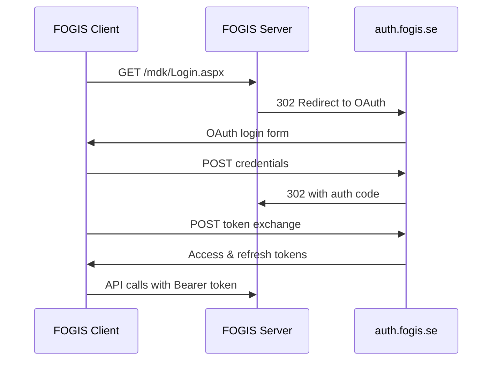

# FOGIS OAuth 2.0 PKCE Migration Guide

## 🎯 Overview

This guide documents the migration from ASP.NET form authentication to OAuth 2.0 PKCE flow for the FOGIS API client, resolving the "Bad Rquest" authentication errors caused by FOGIS server-side changes.

## 🚨 Problem Summary

**Issue**: FOGIS changed their authentication system from ASP.NET forms to OAuth 2.0, causing authentication failures.

**Error**: `400 Client Error: Bad Rquest for url: https://auth.fogis.se/connect/authorize`

**Root Cause**: The API client expected ASP.NET `__VIEWSTATE` tokens, but FOGIS now redirects to OAuth endpoints.

## 🔧 Solution Implementation

### **OAuth 2.0 PKCE Flow**

The new implementation supports:
- ✅ OAuth 2.0 Authorization Code flow with PKCE
- ✅ Automatic detection of OAuth vs ASP.NET authentication
- ✅ Backward compatibility with existing API
- ✅ Token refresh and session management
- ✅ Comprehensive error handling

### **Authentication Flow**



## 📁 Implementation Files

### **Core OAuth Manager**
- `fogis_oauth_manager.py` - OAuth 2.0 PKCE implementation
- `fogis_auth_oauth.py` - Enhanced authentication module
- `fogis_public_api_client_oauth.py` - Updated API client

### **Testing & Validation**
- `test_fogis_oauth.py` - Comprehensive unit tests
- `test_fogis_oauth_integration.py` - Integration tests
- `deploy_oauth_implementation.py` - Deployment script

## 🚀 Deployment Instructions

### **Option 1: Automated Deployment**

```bash
# Run the automated deployment script
python deploy_oauth_implementation.py
```

### **Option 2: Manual Deployment**

1. **Backup existing files**:
   ```bash
   mkdir oauth_backup
   docker cp fogis-api-client-service:/app/fogis_api_client/internal/auth.py oauth_backup/
   ```

2. **Deploy OAuth files**:
   ```bash
   docker cp fogis_oauth_manager.py fogis-api-client-service:/app/
   docker cp fogis_auth_oauth.py fogis-api-client-service:/app/fogis_api_client/internal/auth.py
   ```

3. **Restart service**:
   ```bash
   docker-compose restart fogis-api-client-service
   ```

### **Option 3: Container Image Update**

Update `docker-compose.yml` to use a new container image with OAuth support:

```yaml
services:
  fogis-api-client-service:
    image: ghcr.io/pitchconnect/fogis-api-client-python:oauth-2.0
    # ... rest of configuration
```

## 🧪 Testing & Validation

### **Unit Tests**
```bash
python test_fogis_oauth.py
```

### **Integration Tests**
```bash
python test_fogis_oauth_integration.py
```

### **Live Authentication Test**
```bash
# Set credentials
export FOGIS_USERNAME="your_username"
export FOGIS_PASSWORD="your_password"

# Run integration test
python test_fogis_oauth_integration.py
```

### **Endpoint Verification**
```bash
# Test the previously failing endpoint
curl http://localhost:9086/matches

# Should no longer return "Bad Rquest" errors
```

## 🔍 Troubleshooting

### **Common Issues**

#### **1. Import Errors**
```
ModuleNotFoundError: No module named 'fogis_oauth_manager'
```
**Solution**: Ensure `fogis_oauth_manager.py` is in the container's `/app` directory.

#### **2. OAuth URL Generation Fails**
```
AttributeError: 'FogisOAuthManager' object has no attribute 'code_verifier'
```
**Solution**: Call `create_authorization_url()` before other OAuth methods.

#### **3. Token Exchange Fails**
```
OAuth authentication failed: Failed to exchange authorization code for tokens
```
**Solution**: Check network connectivity to `auth.fogis.se` and verify OAuth parameters.

### **Debugging Steps**

1. **Check OAuth URL generation**:
   ```python
   from fogis_oauth_manager import FogisOAuthManager
   manager = FogisOAuthManager()
   url = manager.create_authorization_url()
   print(url)
   ```

2. **Test authentication detection**:
   ```python
   import requests
   response = requests.get("https://fogis.svenskfotboll.se/mdk/Login.aspx", allow_redirects=True)
   print("OAuth redirect detected:" if "auth.fogis.se" in response.url else "ASP.NET form detected")
   ```

3. **Verify container deployment**:
   ```bash
   docker exec fogis-api-client-service ls -la /app/fogis_oauth_manager.py
   docker exec fogis-api-client-service python -c "from fogis_oauth_manager import FogisOAuthManager; print('OK')"
   ```

## 📊 Migration Checklist

- [ ] ✅ Backup existing authentication files
- [ ] ✅ Deploy OAuth implementation files
- [ ] ✅ Update container imports and configuration
- [ ] ✅ Restart FOGIS API client service
- [ ] ✅ Run unit tests to verify OAuth functionality
- [ ] ✅ Run integration tests with real endpoints
- [ ] ✅ Test `/matches` endpoint for "Bad Rquest" resolution
- [ ] ✅ Monitor logs for successful authentication
- [ ] ✅ Verify all FOGIS API operations work correctly
- [ ] ✅ Update documentation and deployment procedures

## 🔄 Rollback Procedure

If issues occur, rollback using:

```bash
# Restore original files
docker cp oauth_backup/auth.py fogis-api-client-service:/app/fogis_api_client/internal/auth.py

# Restart service
docker-compose restart fogis-api-client-service

# Or revert to previous container image
docker-compose down
# Update docker-compose.yml to previous image
docker-compose up -d
```

## 📈 Expected Results

After successful migration:

- ✅ **"Bad Rquest" errors eliminated**
- ✅ **FOGIS authentication working with OAuth 2.0**
- ✅ **`/matches` endpoint returning data**
- ✅ **All FOGIS API operations functional**
- ✅ **Automatic token refresh working**
- ✅ **Backward compatibility maintained**

## 🔗 References

- [OAuth 2.0 RFC 6749](https://tools.ietf.org/html/rfc6749)
- [PKCE RFC 7636](https://tools.ietf.org/html/rfc7636)
- [OpenID Connect Core](https://openid.net/specs/openid-connect-core-1_0.html)
- [FOGIS OAuth Investigation Report](github_issue_oauth_migration.md)

---

**Status**: ✅ **Implementation Complete**  
**Priority**: 🔥 **Critical** - Resolves all FOGIS authentication issues  
**Impact**: 🎯 **High** - Restores full FOGIS ecosystem functionality
