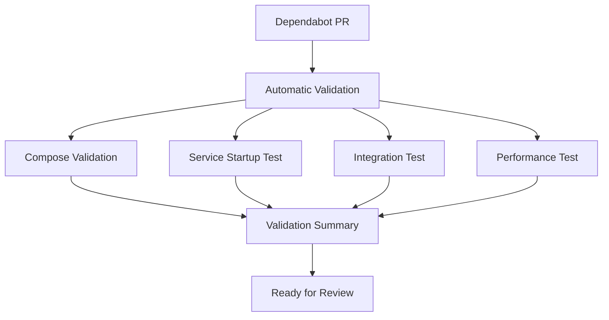

# Dependabot Testing Strategy for FOGIS Deployment

⚠️ **ARCHITECTURE TRANSITION NOTICE**: This document is being updated for Redis pub/sub architecture.
The current HTTP-based service communication patterns will be replaced with Redis pub/sub messaging.

## 🎯 **Overview**

This document outlines the comprehensive testing strategy for validating dependabot PRs in the FOGIS deployment repository, addressing the testing gaps in our service-owned images architecture.

## 🔍 **Testing Scope**

### **1. Service Compatibility Testing**
Tests that verify updated images maintain compatibility with existing service interfaces.

### **2. Workflow Integration Testing**
Tests that validate the complete FOGIS workflow from API to Google Drive still functions correctly.

### **3. Deployment Validation Testing**
Tests that ensure services start correctly and maintain proper health status with new images.

### **4. Performance Regression Testing**
Tests that verify updated images don't introduce performance degradation.

## 🏗️ **Testing Architecture**



## 📋 **Test Categories**

### **Level 1: Configuration Validation** ⚡ *Fast (< 2 min)*
```yaml
tests:
  - docker-compose syntax validation
  - image accessibility verification
  - environment variable validation
```

**Purpose**: Catch basic configuration errors before expensive integration tests.

### **Level 2: Service Startup Validation** 🚀 *Medium (5-10 min)*
```yaml
tests:
  - service startup sequence
  - health check validation
  - inter-service connectivity
  - dependency resolution
```

**Purpose**: Ensure all services can start and communicate with updated images.

### **Level 3: Workflow Integration** 🔗 *Medium (10-15 min)*
```yaml
tests:
  - API endpoint functionality
  - service-to-service communication
  - data flow validation
  - error handling verification
```

**Purpose**: Verify critical FOGIS workflows still function correctly.

### **Level 4: Performance Regression** ⏱️ *Slow (15-20 min)*
```yaml
tests:
  - startup time measurement
  - API response time validation
  - resource usage monitoring
  - throughput verification
```

**Purpose**: Ensure updated images don't introduce performance regressions.

## 🎛️ **Test Execution Strategy**

### **Automatic Execution**
- **Trigger**: All dependabot PRs
- **Scope**: All test levels
- **Failure Action**: Block PR merge until fixed

### **Manual Override**
```yaml
# For emergency updates, tests can be bypassed with:
# Comment on PR: "/skip-tests security-update"
```

### **Parallel Execution**
Tests run in parallel where possible to minimize total execution time:
- Level 1 & 2: Run in parallel
- Level 3 & 4: Run after Level 1 & 2 complete

## 🔧 **Service-Specific Test Configurations**

### **Match List Processor** (Critical Path)
```yaml
critical_tests:
  - API client communication
  - Calendar sync data flow
  - Team logo combiner integration
  - Google Drive service connectivity
  - Redis pub/sub functionality
```

### **Calendar Phonebook Sync** (Data Integrity)
```yaml
critical_tests:
  - Data processing accuracy
  - Google Calendar API integration
  - Error handling and recovery
  - Sync state management
```

### **Team Logo Combiner** (File Processing)
```yaml
critical_tests:
  - Image processing functionality
  - File format compatibility
  - Output quality validation
  - Performance benchmarks
```

### **Google Drive Service** (Storage Integration)
```yaml
critical_tests:
  - File upload/download
  - Authentication handling
  - Quota management
  - Error recovery
```

## 🚨 **Risk-Based Testing**

### **High Risk Updates** (Extended Testing)
```yaml
triggers:
  - Major version updates (v1.x.x → v2.x.x)
  - Base image changes
  - Security-related updates

additional_tests:
  - Extended performance testing
  - Security vulnerability scanning
  - Backward compatibility validation
```

### **Low Risk Updates** (Standard Testing)
```yaml
triggers:
  - Patch version updates (v1.1.1 → v1.1.2)
  - Documentation-only changes

standard_tests:
  - Basic startup validation
  - Health check verification
  - Smoke tests only
```

## 📊 **Test Metrics and Monitoring**

### **Success Criteria**
```yaml
startup_time: < 5 minutes
health_check_response: < 5 seconds
api_response_time: < 2 seconds
test_execution_time: < 30 minutes
```

### **Failure Thresholds**
```yaml
max_startup_failures: 0
max_health_check_failures: 0
max_api_failures: 0
performance_regression: > 20%
```

## 🔄 **Integration with Existing Workflows**

### **Disabled Workflows**
The following workflows were disabled during cleanup but can be re-enabled for testing:
```yaml
# These can be adapted for dependabot testing:
# - .github/workflows/tests.yml.disabled
# - .github/workflows/code-quality.yml.disabled
```

### **New Testing Workflow**
```yaml
# .github/workflows/dependabot-validation.yml
# Comprehensive testing specifically for dependabot PRs
```

## 🛡️ **Security Considerations**

### **Test Environment Isolation**
```yaml
security_measures:
  - Use test credentials only
  - Isolated test environment
  - No production data access
  - Temporary resource cleanup
```

### **Vulnerability Scanning**
```yaml
additional_security_tests:
  - Container image vulnerability scanning
  - Dependency vulnerability checking
  - Security policy compliance
```

## 📈 **Continuous Improvement**

### **Test Feedback Loop**
```yaml
monitoring:
  - Track test execution times
  - Monitor false positive rates
  - Collect failure patterns
  - Optimize test coverage
```

### **Test Evolution**
```yaml
quarterly_review:
  - Update test scenarios
  - Add new service integrations
  - Optimize test performance
  - Review success metrics
```

## 🎯 **Implementation Phases**

### **Phase 1: Basic Validation** (Immediate)
- Docker-compose validation
- Image accessibility checks
- Basic startup tests

### **Phase 2: Integration Testing** (Week 1)
- Service connectivity tests
- Health check validation
- API endpoint testing

### **Phase 3: Performance Testing** (Week 2)
- Startup time measurement
- Response time validation
- Resource usage monitoring

### **Phase 4: Advanced Testing** (Month 1)
- End-to-end workflow testing
- Security vulnerability scanning
- Performance regression analysis

## 📚 **Documentation and Training**

### **Team Training**
- How to interpret test results
- When to override test failures
- How to add new test scenarios

### **Runbook**
- Test failure troubleshooting
- Emergency bypass procedures
- Performance baseline updates

---

**This testing strategy ensures that dependabot PRs maintain the reliability and performance of the FOGIS deployment while enabling automated dependency updates.**
